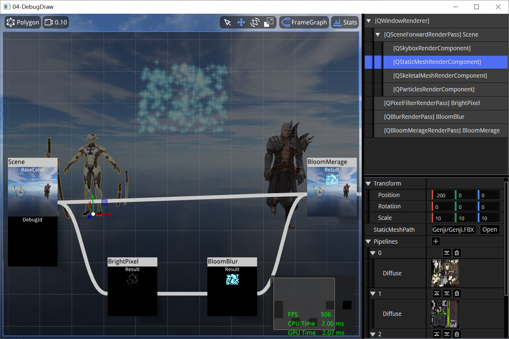
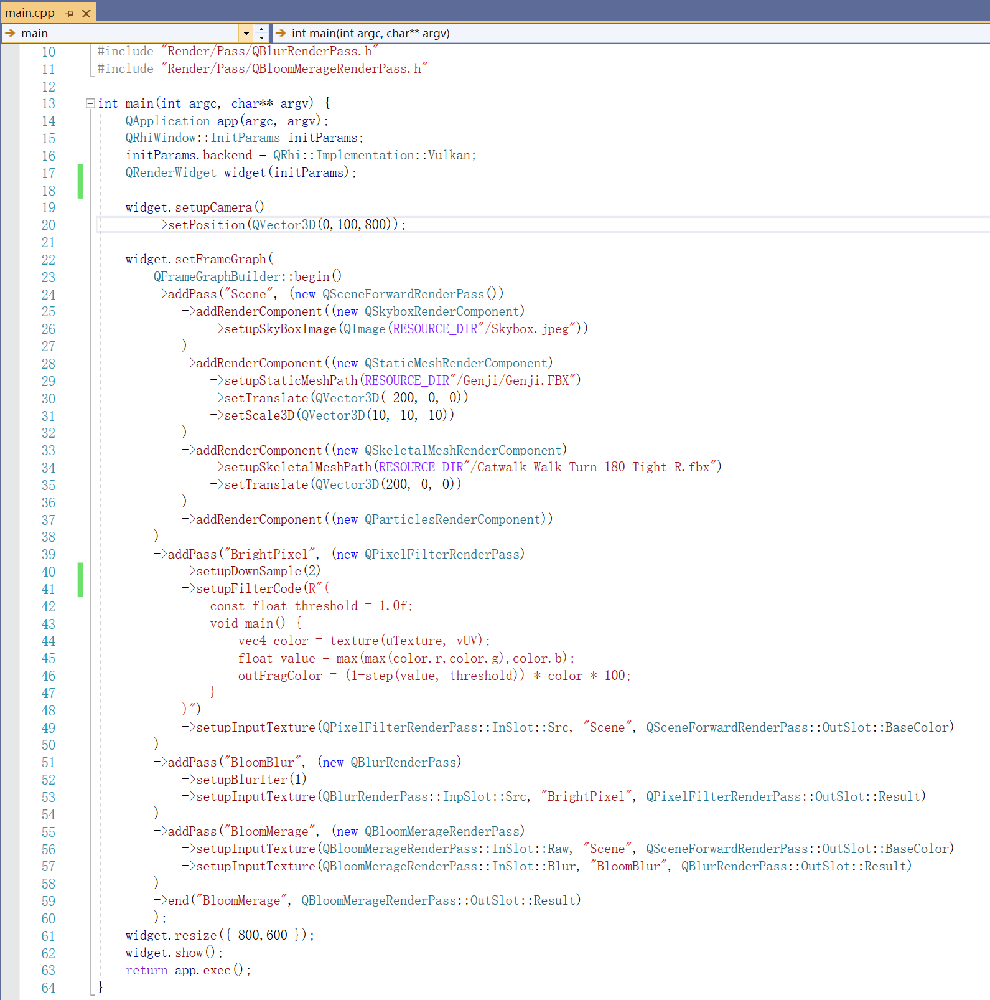

## QEngineUtilities

QEngineUtilities是一个简单的渲染工具库，它包含三个Target：

- **QEngineCore**：渲染架构，包含RHI、FrameGraph、RenderPass、RenderComponent、Asset的简易封装。
- **QEngineEditor**：编辑器套件，包含一些基础属性调整控件，以及基于QtMoc的DetailView。
- **QEngineUtilities**：Lanuch层，对上面两个模块进行组装，例如在`DebugEditor`配置下，会嵌入编辑器，而在`Debug`配置下，就只有Core模块。

## 构建

- **6.0以上版本的Qt库**（当前最新 `6.6.0`）
  - **MSVC编译套件** （当前最新 `2019 64-bit` ) 或 **MinGW编译套件** （当前最新 `11.2.0 64- bit`）：如果IDE是Visual Studio，则需要下载MSVC。
  - **Sources**：Qt的源码
  - **Qt 5 Compatibility Module**：Qt5的兼容模块
  - **Qt Shader Tools**：Qt的着色器编译工具
  - **Additional Libraries**：Qt的扩展库
    - **Qt Multimedia**：Qt的多媒体模块，里面有音视频编解码的功能封装
  - **Qt Debug Information Files（可选）**：用于MSVC下调试Qt的源码，有十几G，比较大

- **Developer and Designer Tools**
  - **Debugging Tools for Windows**：用于MSVC下的调试。
  - **CMake**（当前最新 `3.24.2`）

此外，还需要安装 [Vulkan SDK](https://www.lunarg.com/vulkan-sdk/)

## 说明

QEngineUtilities 主要用于教学和尝试：

- 强调可读性是第一要素
- 没有细致地追求性能（代码细节上有一些瑕疵，在笔者察觉到的时候已经太晚了，由于精力有限，目前笔者也只能选择妥协，非常抱歉...不过放心，这些影响微乎其微）
- 以渲染为核心，包含少量编辑器架构，不会引入一些会导致代码膨胀的模块，如资产管理，网络，异步，ECS...

一个简单的使用示例如下：

