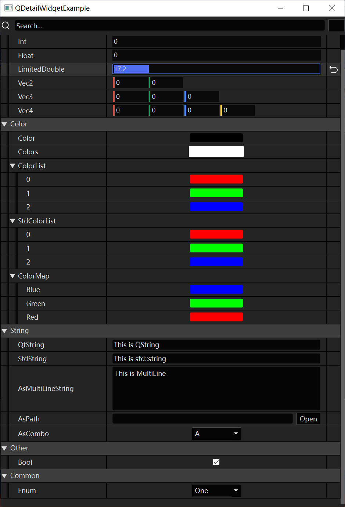

# QDetailWidget

为[Qt Meta-Object System](https://doc.qt.io/qt-6/metaobjects.html) 量身定制的细节面板，具有以下特性：

- 完美依附于Qt的[Qt Meta-Object System](https://doc.qt.io/qt-6/metaobjects.html)，支持任意基础类型的属性调整，且易扩展。
- 支持容器类型（序列、映射）项的自动生成。
- 在不影响Qt的前提下，支持MetaData，可用于为QDetailWidget增加控件的配置信息。
- 高效、美观、易操作的控件。

## 使用方法

### 创建面板

```C++
QDetailWidget widget;
TestObject obj;
widget.SetObjects({&obj});
widget.show();
```

### 元属性

对于任何派生自QObject的类型，均可使用宏**Q_PROPERTY**声明元属性，详情请查阅 [Qt Property](https://doc.qt.io/qt-6/qobject.html#Q_PROPERTY)

### 元信息

Qt Moc 非常简洁，可惜的是它并没有提供为QProperty填充MetaData的方法，因此QDetailWidget中使用的元信息，是在MetaFunction的基础上通过宏进行包装，它的实现细节位于文件`QMetaDataDefine.h`中

```c++
#define Q_META_BEGIN(ClassName) \
	Q_INVOKABLE	static QObjectMetaData ClassName##_GetMetaData(){ \
		QObjectMetaData MetaData;		\

#define Q_META_END(...) \
		return MetaData; \
	}

#define Q_META_NUMBER_LIMITED(PropertyName,Min,Max) \
	MetaData.mPropertyMap[#PropertyName]["Min"] = Min; \
	MetaData.mPropertyMap[#PropertyName]["Max"] = Max; 

#define Q_META_CATEGORY(CategoryName,...) \
	MetaData.mCategoryList<<#CategoryName; \
	for(const QString& PropertyName :QString(#__VA_ARGS__).split(',')){ \
		MetaData.mPropertyMap[PropertyName.trimmed()]["Category"] = #CategoryName; \
	}

#define Q_META_STRING_AS_LINE(PropertyName,PlaceholderText) \
	MetaData.mPropertyMap[#PropertyName]["Type"] = "Line";  \
	MetaData.mPropertyMap[#PropertyName]["PlaceholderText"] = PlaceholderText; 

#define Q_META_STRING_AS_MULTI_LINE(PropertyName,WidgetHeight,PlaceholderText) \
	MetaData.mPropertyMap[#PropertyName]["Type"] = "MultiLine";  \
	MetaData.mPropertyMap[#PropertyName]["Height"] = WidgetHeight; \
	MetaData.mPropertyMap[#PropertyName]["PlaceholderText"] = PlaceholderText; 

#define Q_META_STRING_AS_FILE_PATH(PropertyName) \
	MetaData.mPropertyMap[#PropertyName]["Type"] = "FilePath";  

#define Q_META_STRING_AS_COMBO(PropertyName,...) \
	MetaData.mPropertyMap[#PropertyName]["Type"] = "Combo";  \
	MetaData.mPropertyMap[#PropertyName]["ComboList"] = QJsonArray::fromStringList(QString(#__VA_ARGS__).split(','));  

struct QObjectMetaData{
	QHash<QString, QJsonObject> mPropertyMap;
	QList<QString> mCategoryList;
};

```

## 界面风格

### 代码示例

```c++
#include "QObject"

class TestObject :public QObject {
	Q_OBJECT
	Q_PROPERTY(int Int READ getInt WRITE setInt)
	Q_PROPERTY(float Float READ GetFloat WRITE SetFloat)
	Q_PROPERTY(double LimitedDouble READ GetLimitedDouble WRITE SetLimitedDouble)
	Q_PROPERTY(bool Bool READ GetBool WRITE SetBool)
	Q_PROPERTY(TestEnum Enum READ GetEnum WRITE SetEnum)
	Q_PROPERTY(QString QtString READ GetQtString WRITE SetQtString)
	Q_PROPERTY(std::string StdString READ GetStdString WRITE SetStdString)
	Q_PROPERTY(QString AsMultiLineString READ GetAsMultiLineString WRITE SetAsMultiLineString)
	Q_PROPERTY(QString AsPath READ GetAsPath WRITE SetAsPath)
	Q_PROPERTY(QString AsCombo READ GetAsCombo WRITE SetAsCombo)
	Q_PROPERTY(QVector2D Vec2 READ GetVec2 WRITE SetVec2)
	Q_PROPERTY(QVector3D Vec3 READ GetVec3 WRITE SetVec3)
	Q_PROPERTY(QVector4D Vec4 READ GetVec4 WRITE SetVec4)
	Q_PROPERTY(QColor Color READ GetColor WRITE SetColor)
	Q_PROPERTY(QColors Colors READ GetColors WRITE SetColors)
	Q_PROPERTY(QList<QColor> ColorList READ GetIntList WRITE SetIntList)
	Q_PROPERTY(std::vector<QColor> StdColorList READ GetStdColorList WRITE SetStdColorList)
	Q_PROPERTY(QMap<QString,QColor> ColorMap READ GetColorMap WRITE SetColorMap)


	Q_META_BEGIN(TestObject)
		Q_META_CATEGORY(Number, Int, Float, LimitedDouble, Vec2, Vec3, Vec4)
		Q_META_CATEGORY(Color,Color,Colors, ColorList, StdColorList,ColorMap)
		Q_META_CATEGORY(String, QtString, StdString, AsMultiLineString, AsPath, AsCombo)
		Q_META_CATEGORY(Other,Bool)
		Q_META_NUMBER_LIMITED(LimitedDouble, 0, 100)
		Q_META_STRING_AS_LINE(QtString,"This is QString")
		Q_META_STRING_AS_LINE(StdString,"This is std::string")
		Q_META_STRING_AS_MULTI_LINE(AsMultiLineString,80,"This is MultiLine")
		Q_META_STRING_AS_FILE_PATH(AsPath)
		Q_META_STRING_AS_COMBO(AsCombo,A,B,C,D)
	Q_META_END()

public:
	enum TestEnum {
		One,
		Two,
		Three
	};
	Q_ENUM(TestEnum)
        
    //省略声明...
};
```

### Qt


### Unreal



## 自定义

### 属性

自定义属性一般需要以下步骤：

- 派生 QDetailWidgetPropertyItem
- 使用宏**Q_DETAIL_SUPPORTED_TYPES(...)**在派生类中定义绑定好的属性
- 覆盖虚函数  `QWidget* GenerateValueWidget()` 
  - 在函数中创建属性的调节控件
  - 调用`GetHandler()`可以得到属性句柄
  - 使用`GetHandler()->Bind()`将当前控件与该属性进行绑定，需要提供控件的：
    - ValueChangedNotify信号
    - Getter函数（lambda表达式）：用于获取当前控件到该属性的转换
    - Setter函数（lambda表达式）：用于属性到当前 控件的值 的转换

在`Src/Items/Customization`目录下，有许多Property的自定义示例，以Bool为例：

```c++
#ifndef QDPI_Bool_h__
#define QDPI_Bool_h__

#include "Items\QDetailWidgetPropertyItem.h"

class QDPI_Bool :public QDetailWidgetPropertyItem {
public:
	Q_DETAIL_SUPPORTED_TYPES(bool);		//将此Item与bool类型绑定
	virtual QWidget* GenerateValueWidget() override;
};
#endif // QDPI_Bool_h__
```

```c++
#include "QDPI_Bool.h"
#include "QCheckBox"

QWidget* QDPI_Bool::GenerateValueWidget() {
	QCheckBox* checkBox = new QCheckBox;
	checkBox->setCheckState(GetValue().toBool() ? Qt::Checked : Qt::Unchecked);
	GetHandler()->Bind(checkBox, &QCheckBox::stateChanged,
		[checkBox]() {
			return checkBox->checkState() == Qt::Checked;
		},
		[checkBox](QVariant var) {
			checkBox->setCheckState(var.toBool() ? Qt::Checked : Qt::Unchecked);
		}
		);
	return checkBox;
}
```

### Waiting...

- [ ] 属性菜单
- [ ] 撤销/重做
- [ ] 容器元素的增删
